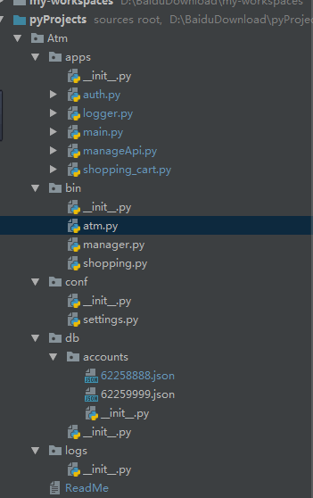

# 1.装饰器
1. 定义：本质是函数，功能装饰其他函数，就是为其他函数添加附加功能
2. 原则：a,不能修改被装饰的函数的源代码， b,不能修改被装饰的函数的调用方式
实现装饰器知识储备：
1. 函数即‘变量’
2. 高阶函数
    a. 把一个函数名当做实参传给另外一个函数（在不修改被装饰函数源代码的情况下添加新功能）
    b. 返回值中包含函数名（不修改函数调用方式）
3. 嵌套函数
高阶函数 + 嵌套函数 -> 装饰器

```
"""
装饰器：
1. 定义：本质是函数，功能装饰其他函数，就是为其他函数添加附加功能
2. 原则：a,不能修改被装饰的函数的源代码， b,不能修改被装饰的函数的调用方式
实现装饰器知识储备：
1. 函数即‘变量’
2. 高阶函数
3. 嵌套函数
高阶函数 + 嵌套函数 -> 装饰器
"""
import time

def timmer(func):
    def warpper(*args, **kwargs):
        start_time = time.time()
        func()
        stop_time = time.time()
        print('the func run time is %s ' % (stop_time - start_time))
    return warpper()

@timmer
def test1():
    time.sleep(3)
    print('in the test1')
test1()

```

```
# 装饰home和bbs方法，判断是否登录
import time

username, password = 'admin1', 'admin11'

def auth(auth_type):
    print('auth func is %s', auth_type)
    def outer_wrapper(func):
        def wrapper(*args, **kwargs):
            if auth_type == 'local':
                _username = input('Username:').strip()
                _password = input('Password:').strip()
                if _username == username and _password == password:
                    print('\033[1;32;1mLogin success. \033[1m')
                    return func(*args, **kwargs)
                else:
                    print('\033[1;31;1mYour username or password are error! \033[1m')
            elif auth_type == 'ldap':
                print("I do't kown!")
        return wrapper
    return outer_wrapper

def index():
    print('welcome to index page')

@auth(auth_type = 'local')
def home():
    print('welcome to home page')
    return 'home page'

@auth(auth_type = 'ldap')
def bbs():
    print('welcome to bbs page')
    return 'bbs page'

index()
print(home())
bbs()
```

# 2.迭代器：
    可以直接作用于for循环的数据类型有一下几种：
       一类是集合数据类型，如list，tuple，dict，set，str等
       一类是generator，包括生成器和yield的generator function
    这些可以直接作用于for循环的对象统称为可迭代对象（可循环对象）：Iterable
    可以使用isinstance()判断一个对象是否是Iterable对象
    isinstance()判断一个对象是否可迭代或可循环
    可以被next()函数调用并不断返回下一个值的对象称为迭代器，Iterator
    迭代对象Iterable可以通过iter()方法转成迭代器
```
from collections import Iterable
print(isinstance([], Iterable))

a = [1, 2, 3]
print(dir(a))   # dir查询a可调用方法
print(isinstance((x for x in range(10)), Iterable))

# 迭代对象变成迭代器，使用iter()方法
b = iter(a)
print(b.__next__())
print(isinstance(b, Iterable))


```
# 3.生成器
通过列表生成式，我们可以直接创建一个列表。但是，受到内存限制，列表容量肯定是有限的。而且，创建一个包含100万个元素的列表，不仅占用很大的存储空间，如果我们仅仅需要访问前面几个元素，那后面绝大多数元素占用的空间都白白浪费了。

所以，如果列表元素可以按照某种算法推算出来，那我们是否可以在循环的过程中不断推算出后续的元素呢？这样就不必创建完整的list，从而节省大量的空间。在Python中，这种一边循环一边计算的机制，称为生成器：generator。

要创建一个generator，有很多种方法。第一种方法很简单，只要把一个列表生成式的[]改成()，就创建了一个generator：

```
a = [1, 2, 4]
print(a)

b = [i*2 for i in range(10)]    # 列表生成式
print(b)
```

```
a = [1, 3, 4, 5, 5]
print(a)
print(range(10))

b = [ i*2 for i in range(10)]
print(b)

c = ( i*2 for i in range(10))   # 生成器
print(c)

for i in c:
    print(i)
```

```
# @Author: Pofoo
# @Time: 2017/11/6 10:46

"""
斐波那契数列：
1,1，2，3，5，8，13，21，34，...
"""

def fib(max):
    n = 0
    a = 0
    b = 1
    while n < max:
        # print(b)
        yield b     # 生成器generator关键字
        c = a
        a = b
        b = a + c
        n += 1
    return '----done'

# f = fib(6)
g = fib(11)
while True:
    try:
        x = next(g)
        print('g:', x)
    except StopIteration as e:
        print('Generator return value:', e.value)
        break
# print(f.__next__())
# print(f.__next__())
# print(f.__next__())
# print(f.__next__())
# print(f.__next__())
# print(f.__next__())
# print(f.__next__())

# print('start loop'.center(50, '-'))
# for i in f:
#     print(f.__next__())
# print('end loop'.center(50, '-'))

```

```
# 生成器并行
import time

def consumer(name):
    print('【吃货部】【%s】准备吃包子咯！' % name)
    while True:
        bun = yield
        print('【吃货部】【%s】的包子被【%s】吃掉了！！！' % (bun, name))

def production(number, *args):
    a = consumer(args[0])
    b = consumer(args[1])
    a.__next__()
    b.__next__()
    for i in range(1, number+1):
        time.sleep(1)
        print('【生产部】 正在生产%s号包子...' % i)
        time.sleep(0.5)
        a.send(i)
        b.send(i)

production(20, 'Pofoo','wendy')

```

# 4.内置函数


```
# @Author: Pofoo
# @Time: 2017/11/6 16:39

print(abs(-1))      # 绝对值
print(all([]))
print(any([]))      # any 空返回false，非空返回true
print(any([1, 2]))
print(ascii('中国')) # 字符串形式
print(bin(11))      # 十进制转成二进制
print(bool(0))      # 判断真假
a = bytes('abcd', encoding='utf-8')
b = bytearray('abcd', encoding='utf-8')
print(a.capitalize(), a)
print(b[0]) # 转成ASCII码
b[1] = 111   # 必须负责成ASCII
print(b)
def say_hi():pass
print(callable(say_hi))
print(chr(99))  # 输入十进制，返回字符
print(ord('c')) # 输入字符，返回十进制
c = 'for i in range(10):print(i)'
d = compile(c, '', 'exec')  # 将字符串代码编译，变成可执行代码，exec有同样作用
print(compile(c, '', 'exec'))
exec(d)  # 执行编译后的代码
eval(d)  # 执行编译后的代码
print(dir(c))   # 查看c可调用的方法

print(divmod(5, 3)) # 返回(1, 2) 商和余数
e = filter(lambda n:n>5, range(10))     # filter过滤列表range(10)中大于5的列表，返回filter obj
f = map(lambda n: n*2, range(10))       # map重新生成一个新的列表
print(filter(lambda n:n>5, range(10)), map(lambda n: n*2, range(10)))
for i in e:
    print(i)
for i in f:
    print(i)

import functools
res = functools.reduce(lambda x, y: x+y, range(10))     # reduce叠加，剩
print(res)

a = frozenset([1, 2, 3, 4])     # frozenset:不可变的集合
print(globals())    # globals(): 返回globals所在文件的全局变量内容，转成字典

print(hash('fasdalksflajsdlaskldasdaaaaaaaaaaa'))
print(hex(1211))     # 将十进制转成十六进制
def test():
    local_var = 333
    print(locals())
print(globals())
print(globals().get('local_var'))

print(type(repr(11111)), repr(11111))   # 将object转化成str
print(reversed('11123123'))   # 与list的reversed一致
print(round(1.11112, 2))    # 保留小数位数

a = range(20)
print(a[slice(2, 5)])   # 切片

dict_str = {6:2, 8:0, 1:4, -5:6}
print(dict_str, sorted(dict_str.items()))   # sorted变成list并有序排序，
print(sorted(dict_str))     # 按key排序
print(sorted(dict_str.items(), key=lambda x:x[1]))  # 按value排序

a = [1, 2, 3, 4, 5, 6]
b = ['a', 'b', 'c', 'd']
# print(zip(a, b))
for i in zip(a, b):     # zip:2个list连接，拉链
    print(i)

import time
__import__('time')  # 导入模块，字符串
```

```
# lambda用法
def say_hi(n):
    print(n)

say_hi('a_test')

x = lambda n: print(n)  # 与say_hi()一样的作用，只能写三元运算
y = lambda n: 3 if n<4 else n
x('nnn1')
print(y(5))
```
# 5. json/pickle序列化与反序列化
用于序列化的两个模块：
json，用于字符串 和 python数据类型间进行转换
pickle，用于python特有的类型 和 python的数据类型间进行转换
Json模块提供了四个功能：dumps、dump、loads、load
pickle模块提供了四个功能：dumps、dump、loads、load

```
# 序列化
import json
import pickle

def say_hi(name):
    print('Hi,', name)

dict_info = {
    'name': 'wendy',
    'age': 12,
    'func': say_hi
}

# with open('test15.txt', 'w', encoding='utf-8') as f:
#     f.write(str(dict_info))

with open('test15.txt', 'wb') as f:   # json为w， pickle为wb
    # f.write(json.dumps(dict_info))
    f.write(pickle.dumps(dict_info))    # 二进制

```

```
# 反序列化
import json
import pickle
def say_hi(name):
    print('Hi2222,', name)

# with open("test15.txt", 'r', encoding='utf-8') as f:
#     data = f.read()
#     print(type(eval(data)))

# with open("test15.txt", 'r', encoding='utf-8') as f:
#     data = f.read()
#     print(type(eval(data)))

with open("test15.txt", 'rb') as f:
    # data = json.loads(f.read())
    # print(data['age'])
    data = pickle.loads(f.read())
    print(data['func']('a_test'))
```

# 6. 作业
1. 额度15000或自定义
2. 实现购物商城，买东西加入购物车，调用信用卡接口结账
3. 可以提现，手续费5%
4. 支持多账户登录
5. 支持账户转账
6. 记录每月日常消费流水
7. 提供还款接口
8. ATM记录操作日志
9. 提供管理接口，包括添加账户、用户额度、冻结账户等
10.用户认证用装饰器

blog：

程序说明：
1. atm管理人员登录的用户名和密码为：admin/admin
2. 默认已经新增了2个账户，分别为62258888/62259999，密码都为123456，状态正常，额度和余额都是15000
3. ATM管理人员入口：执行bin目录下manage.py文件
4. atm账户管理：执行bin目录下atm.py文件
5. shopping购物：执行bin目录下shopping.py文件

程序结构：<br>
Atm<br>
├──ReadMe<br>
├──apps<br>
│      ├──__init__.py<br>
│      ├──auth.py   # 用于用户登录和用户认证模块<br>
│      ├──logger.py # 日志记录模块<br>
│      ├──main.py   # 主要逻辑、atm和manage交互模块<br>
│      ├──managerApi.py # atm管理员操作账户模块<br>
│      └──shopping_cart.py  # 购物及其交互模块<br>
├──bin<br>
│      ├──__init__.py<br>
│      ├──atm.py    # atm执行程序<br>
│      ├──manager.py    # atm管理人员执行程序（默认账户和密码为admin/admin）<br>
│      └──shopping.py   # 购物执行程序<br>
├──conf<br>
│      ├──__init__.py<br>
│      └──settings.py   # 配置文件<br>
├──db   # 账户保存文件<br>
│      ├──__init__.py<br>
│      ├──62258888.json<br>
│      └──62259999.json<br>
└──logs # 日志文件<br>
        ├──logger.log<br>
        ├──operate.log<br>
        └──transaction.log<br>

